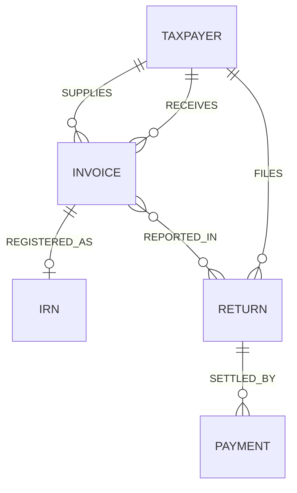

# Graph Model Architecture

The PramanaGST Knowledge Graph converts the tabular data of Contract 1 into a strictly defined Neo4j directed graph. 

## The Modeling Philosophy
Entities are nodes. Transactions are relationships. States are node properties.
Instead of querying raw tables for "mismatches," the system traverses paths. A broken path indicates a compliance failure.

## Graph Constraints
To ensure data quality at the DB level, the following schema rules apply:
1. `CREATE CONSTRAINT FOR (t:Taxpayer) REQUIRE t.gstin IS UNIQUE`
2. `CREATE CONSTRAINT FOR (i:Invoice) REQUIRE (i.supplierGstin, i.invoiceNumber, i.filingPeriod) IS UNIQUE`
3. `CREATE CONSTRAINT FOR (r:ReturnFiling) REQUIRE r.returnId IS UNIQUE`
4. `CREATE CONSTRAINT FOR (p:Payment) REQUIRE p.paymentId IS UNIQUE`
5. `CREATE CONSTRAINT FOR (irn:IRN) REQUIRE irn.irn IS UNIQUE`
